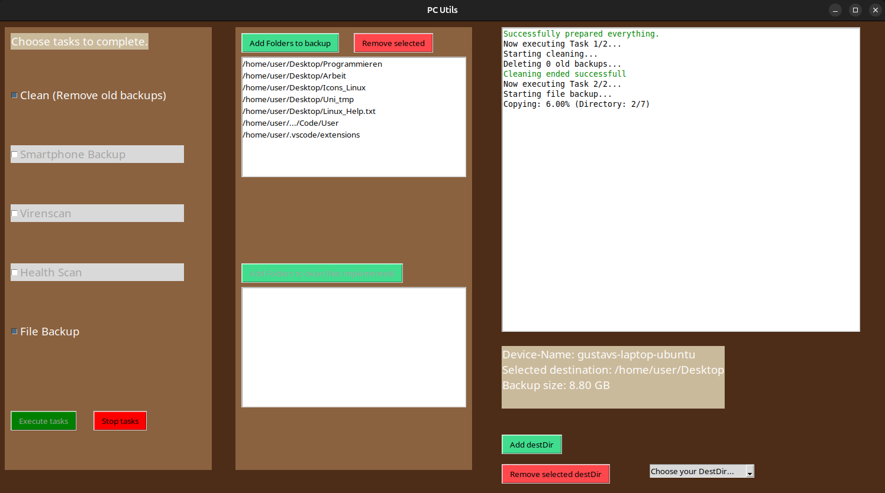

# 🛡️ Auto-Backup your files!

A lightweight tkinter GUI written in python to automate your backups.

> Disclaimer:
> - work in progress!
> - at the moment only the backup task is implemented.
> - at the moment only works with folders, not single files!
> - a full `requirements.txt` will be added later


<details>
  <summary>📑 Table of Contents</summary>
  <ul>
    <li><a href="#highlights">🌟 Highlights</a></li>
    <li><a href="#usage">▶️ Usage</a></li>
    <li>
      <a href="#setup">🛠️ Setup</a>
      <ul>
        <li><a href="#prerequisites">Prerequisites</a></li>
        <li><a href="#installation">Installation</a></li>
      </ul>
    </li>
    <li><a href="#feedback">💭 Feedback</a></li>
  </ul>
</details>

## 🌟 Highlights <a id="highlights"></a>
- Choose where to backup which folders
- auto-saves your configuration once set
- supports configs for multiple users
  - e.g. useful if you have 1 SSD to back up multiple devices

## ▶️ Usage <a id="usage"></a>
Screenshot from the program executnig a backup: 


1. launch the GUI
2. the `config.yaml` is parsed for your prior configs; when you first launch the programm or changed your hostname, a new `config.yaml` is automatically created with some basic paths
3. edit paths to backup and your destination path
4. If task is started, you will see messages and/or progressbars on the rigth indicating the task is running
5. If something fails (, which will hopefully never happen ;)) you will be warned and can take a look in trhe `.log` file (same directionary as the `main.py` script)

## 🛠️ Setup <a id="setup"></a>
This little guide will guide you to setup this programm on your local machine.
> tested on Windows/Linux

### Prerequisites <a id="prerequisites"></a>
Before installing or using this project, make sure the following are available on your system:

- rsync>=3.1.0 (for Linux)
- python>=3.10
- pip (usually included with Python)
- git (optional, if cloning the repository)

> It is recommended to have Python in your `PATH`, otherwise you always have to write the full path to your local `python.exe`. Linux/MacOS have python pre-installed and in `PATH` by default, and on windows you have to [install python](http://python.org/downloads/) and [put it in your path](https://phoenixnap.com/kb/add-python-to-path) (if not done automatically at installation)

### Installation <a id="installation"></a>
If you have fullfilled all the requirements listed above, you can
```bash
git clone https://github.com/Gazoooo/backup.git # clone repo
cd backup # navigate to project directory
pip install -r requirements.txt # install the necessary packages
python Scripts/main.py # run the script
```

## 💭 Feedback <a id="feedback"></a>
I created this project myself and really appreciate any feedback!  
If you have questions, find a bug, or have suggestions for improvement, feel free to reach out or open an issue.

You can contact me [via mail](mailto:gustav@otzen.de).
